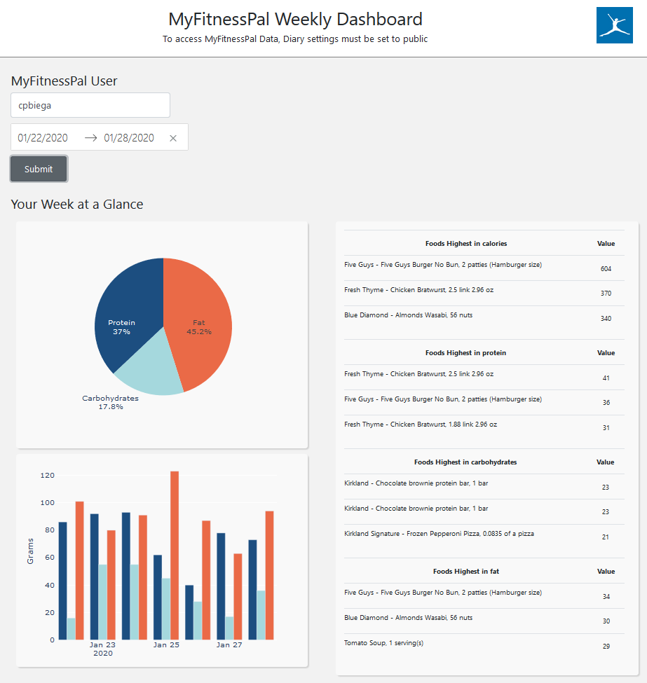
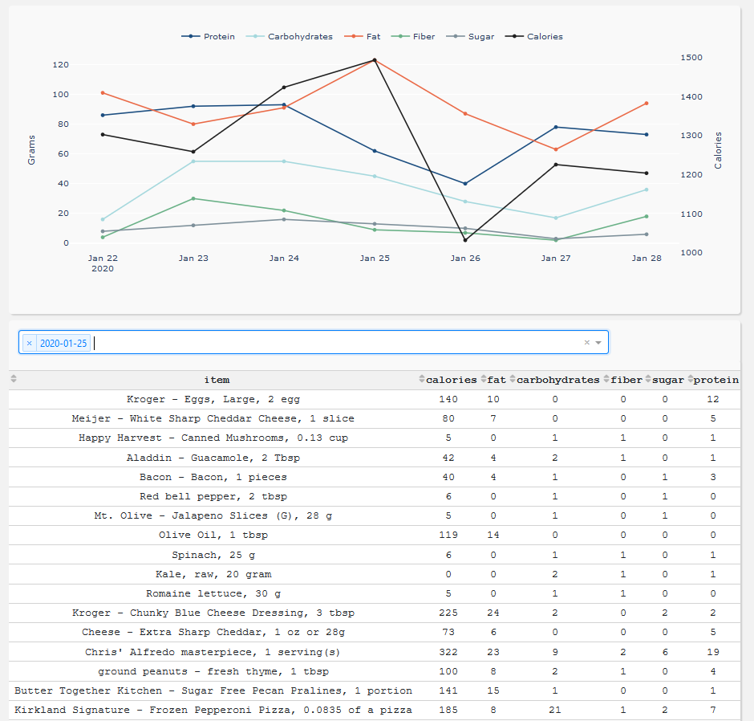

# MFP-Dash-App

## Introduction
`MFP-Dash-App` is a dashboard to give MyFitnessPal users more insights into the nutrition information that they are already logging through the app. At this point, the application is not being actively hosted on any public domain. The app was previously running at https://djbiega.pythonanywhere.com/ but I had to take it down after adding in PostgreSQL (the free tier does not support PostgreSQL)

## Motivation
MyFitnessPal is currently very limited with how it displays your own nutrition data, and even more so if you want to look at what your friends have entered. As is, you can only see the entries that have been entered on a daily basis which makes it difficult to see how closely what you've been eating aligns with your goals. To solve this, I created this application which will scrape all of your logged nutrition date since January 1, 2016 into a database which can then be used to quickly access and visualize your nutrition data over time. To avoid bombarding the MyFitnessPal site, your data will not be updated again until you use use the application again -- upon which it will then scrape the dates which have gone by since you last used the application.

## Who could this be useful for
* Personal Trainers/Nutritionists looking to get better insights into how their clients are maintaining their diets
* Anyone who wants better insights into their nutrition data

## Screenshots



## Built With
* [Dash](https://dash.plot.ly/) - Main UI and interactive application components
* [Plotly Python](https://plot.ly/python/) - Used to create the interactive plots
* [Flask](https://flask.palletsprojects.com/en/1.1.x/) - Used as a server for hosting the application

## Requirements
All required packages can be located in the ``requirements.txt`` file. To re-create this application, run the following steps:
```
git clone https://github.com/djbiega/MFP-Dash-App.git
cd MFP-Dash-App
python3 -m venv venv
source venv/bin/activate
pip install -r requirements.txt
```

## How to use this app
Run this app locally with either
```
python app.py
```
or 
```
python wsgi.py
```
Then open a browser and navigate to http://127.0.0.1:5000/. The dashboard will be up and running. You can then search for any user on MyFitnessPal. However, you will only be able to look at their data if their Diary settings are set to public in MyFitnessPal.

## Future work
* Allow users the option to export their data and download it locally to their machine
* Dockerize the application for ease of portability and hosting in an EC2 instance within ECS

## Lessons Learned
* MORE UNIT TESTING! I spent hours debugging problems which could have very easily been avoided if I had committed to following a test-driven development flow
* Focus on breaking large features down into smaller, more manageable chunks. There were times where I felt that I was running in circles because I was so focused on trying to implement one huge feature that I wound up undoing previous code (and I didn't catch it until later because I didn't unit test!)
